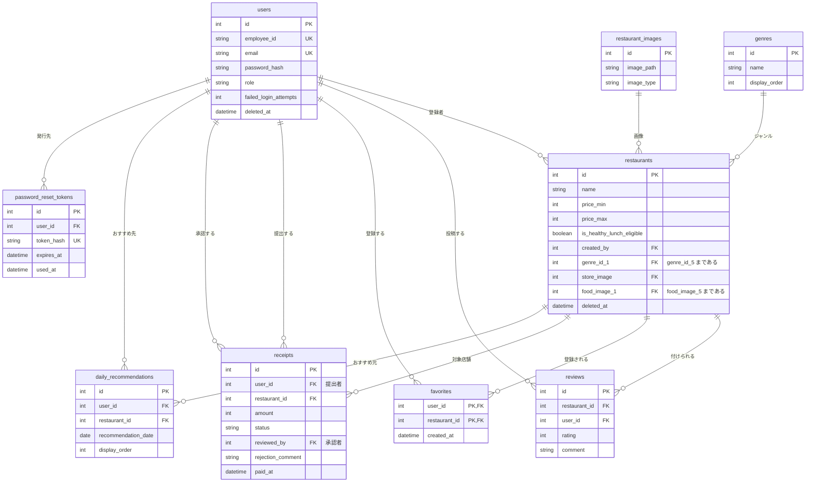

# メグルメ ER図（Mermaid版）

GitHubやNotionのMarkdownに貼ると、そのまま図として表示されます。

```mermaid
erDiagram
    genres {
        int id PK
        string name
        int display_order
    }
    users {
        int id PK
        string employee_id UK
        string email UK
        string password_hash
        string role
        int failed_login_attempts
        datetime deleted_at
    }
    restaurant_images {
        int id PK
        string image_path
        string image_type
    }
    restaurants {
        int id PK
        string name
        int price_min
        int price_max
        boolean is_healthy_lunch_eligible
        int created_by FK
        int genre_id_1 FK "genre_id_5 まである"
        int store_image FK
        int food_image_1 FK "food_image_5 まである"
        datetime deleted_at
    }
    reviews {
        int id PK
        int restaurant_id FK
        int user_id FK
        int rating
        string comment
    }
    favorites {
        int user_id PK, FK
        int restaurant_id PK, FK
        datetime created_at
    }
    receipts {
        int id PK
        int user_id FK "提出者"
        int restaurant_id FK
        int amount
        string status
        int reviewed_by FK "承認者"
        string rejection_comment
        datetime paid_at
    }
    daily_recommendations {
        int id PK
        int user_id FK
        int restaurant_id FK
        date recommendation_date
        int display_order
    }
    password_reset_tokens {
        int id PK
        int user_id FK
        string token_hash UK
        datetime expires_at
        datetime used_at
    }

    genres ||--o{ restaurants : "ジャンル"
    restaurant_images ||--o{ restaurants : "画像"
    users ||--o{ restaurants : "登録者"
    users ||--o{ reviews : "投稿する"
    restaurants ||--o{ reviews : "付けられる"
    users ||--o{ favorites : "登録する"
    restaurants ||--o{ favorites : "登録される"
    users ||--o{ receipts : "提出する"
    restaurants ||--o{ receipts : "対象店舗"
    users ||--o{ receipts : "承認する"
    users ||--o{ daily_recommendations : "おすすめ先"
    restaurants ||--o{ daily_recommendations : "おすすめ元"
    users ||--o{ password_reset_tokens : "発行先"
```
